# CS304 PeachIDE Sprint 1
**_An Intelligent Course-Aware IDE_**  
**Authors**: Ben Chen, Mingzhi Chen, Tianrun Qiu, Zhuo Wang, Yicheng Xiao

---

## Architecture Diagram

> **功能概览**  
> - Database  
> - Course View  
> - Code Space  
> - AI Integration  
> - Material View  
> - Code Editor  
> - Markdown Editor  

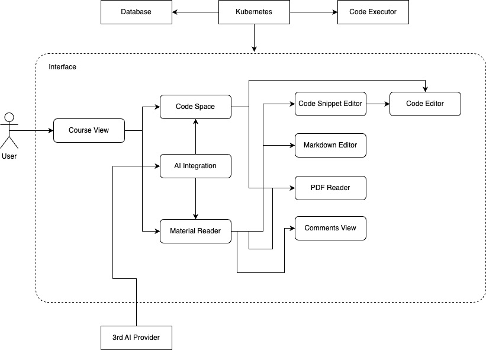

---

## UI Design

### Feature 1
**Create, manage, and collaborate in your code spaces**  
- ✅ 使用 `Monaco-Editor` 提供 IDE 编辑功能  
- ✅ 使用 `yjs` 实现多人协同编辑  
- ✅ 可以查看 PDF 文件  
- ✅ 提供后台连接的终端 (CLI)

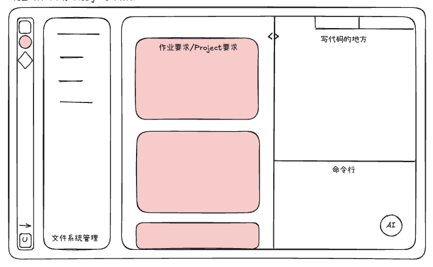

---

### Feature 2
**Find your resources and execute code snippets on the fly**  
- ✅ 使用 `react-pdf` 演示 PDF  
- ✅ 为 PDF 每一页提供评论区  
- ✅ 在 PDF 文件中插入代码片段  
- ✅ 使用富文本编辑器记录笔记  

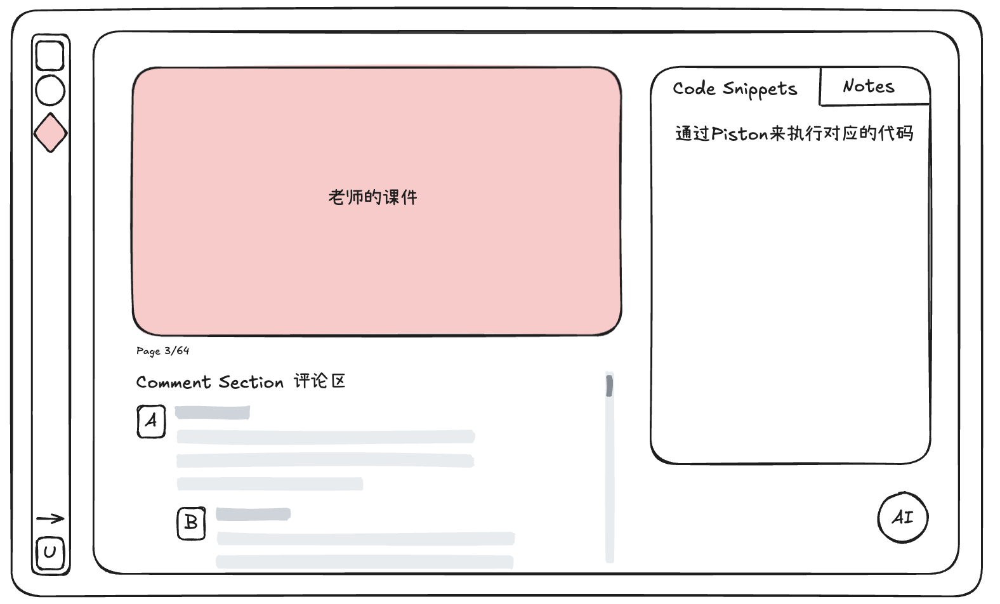

---

### Feature 3
**Organize and track your learning progress**  
- ✅ 课程信息中心，整合课件、作业、分组信息  
- ✅ 使用日历跟踪学习进度  

| 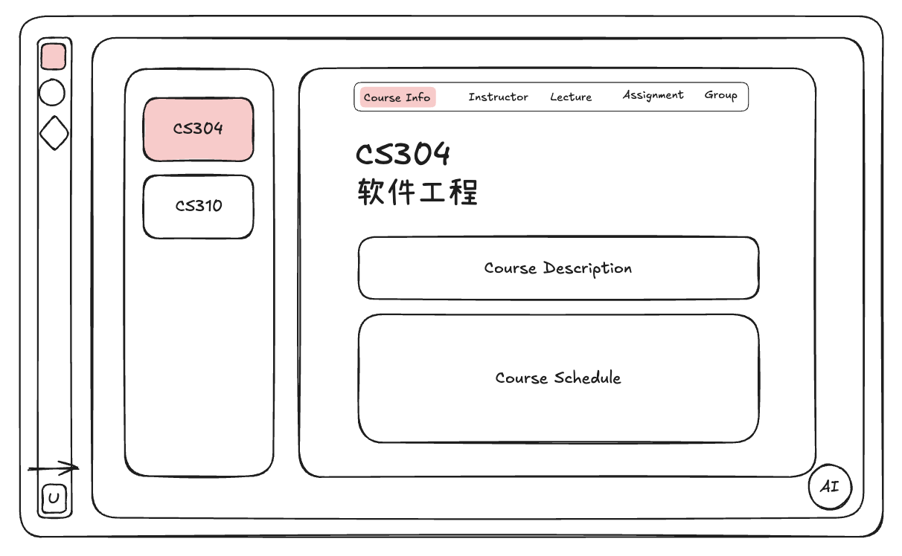 | 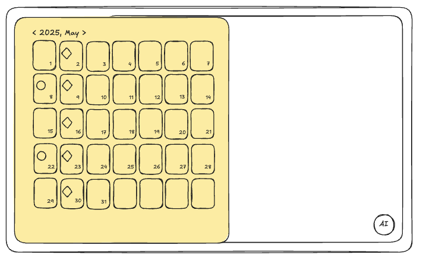 |
| --- | --- |
| _Class Info_ | _Calendar_ |

- ✅ 查看发布的课件与作业  
- ✅ 在“分组广场”中可以与同学组成学习小组  

| 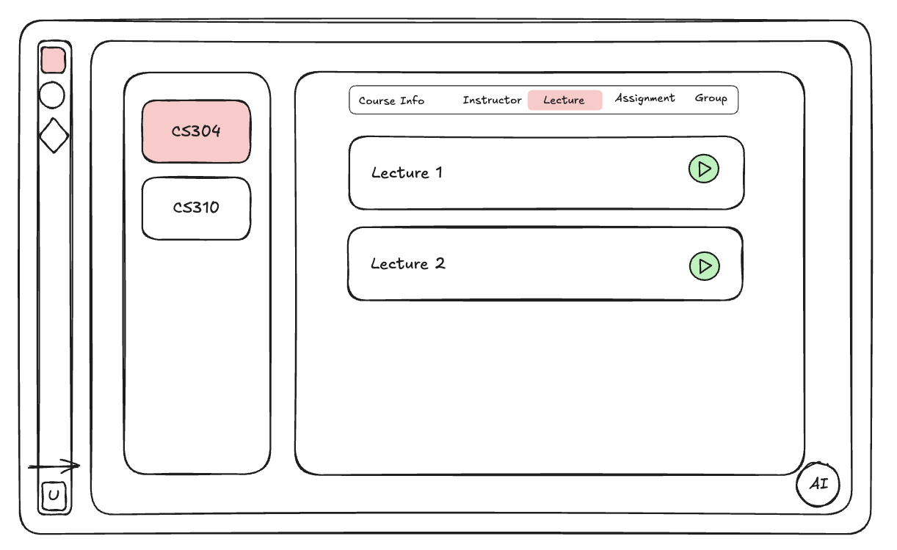 | 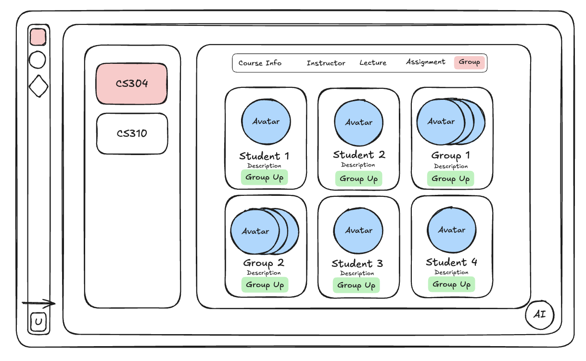 |
| --- | --- |
| _Class Lecture_ | _Class Group_ |

---

### Feature 4
**Empower your study with an AI assistant**  
- ✅ 帮助总结幻灯片内容  
- ✅ 基于幻灯片内容自动生成测验  
- ✅ 在 IDE 环境中协助解决问题  

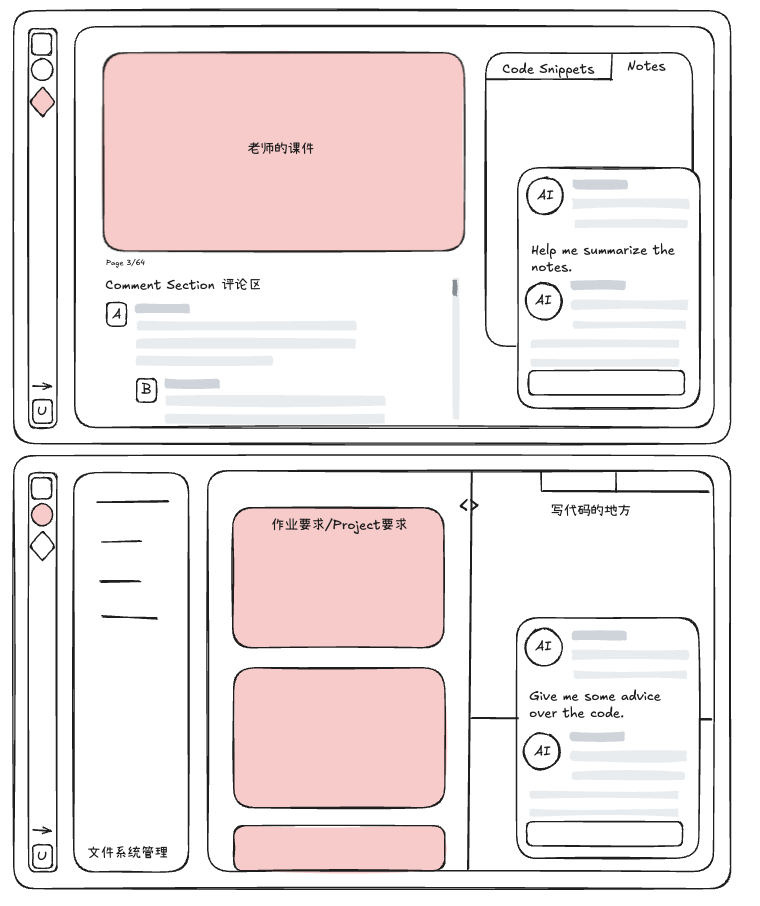

---

## UI Implementation

> 以上展示了主要的界面和功能布局。  
> 具体实现细节请参考对应的前端、后端与协同技术文档。

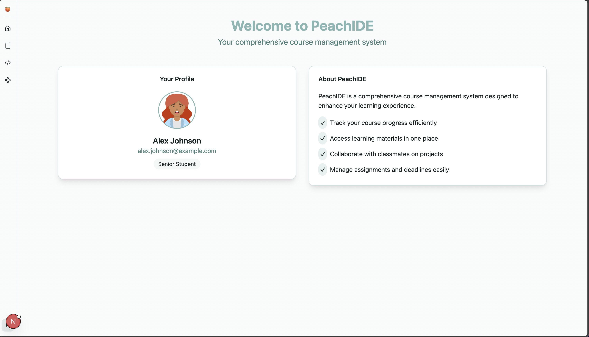
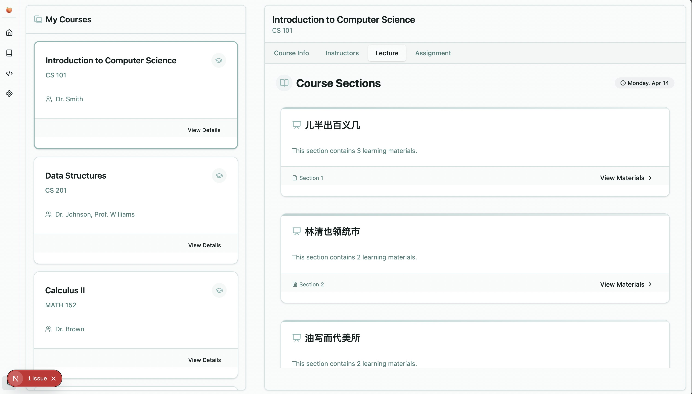
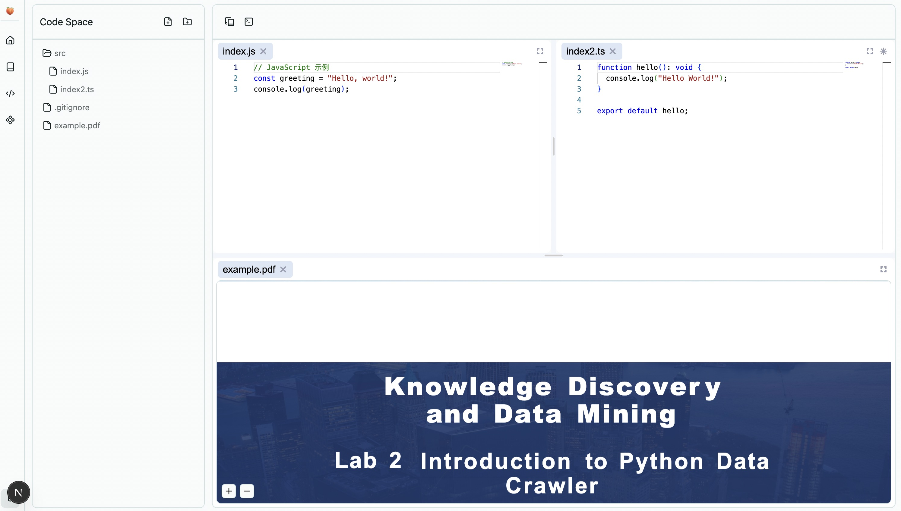
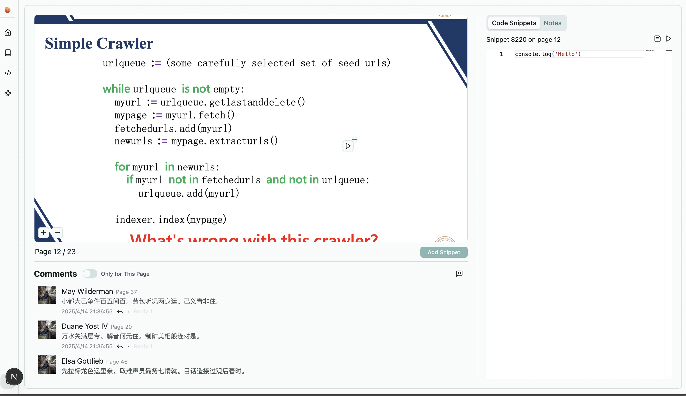